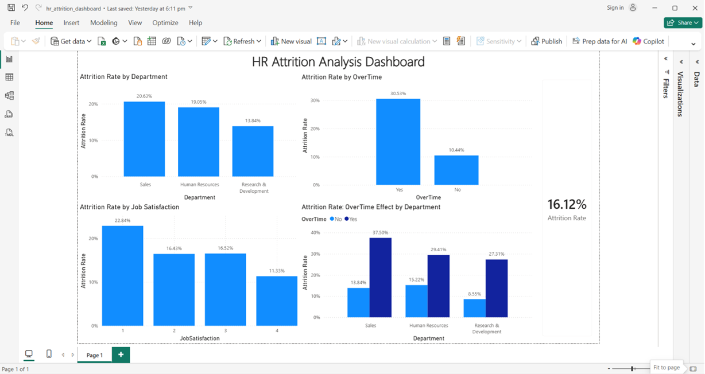

# HR Attrition & Workforce Dashboard

Built a relational data model in Power BI to analyze employee attrition across 1,470 records, identifying overtime and job satisfaction as the strongest drivers of turnover — stronger signals than department alone.

## Business Question

Which factors are most strongly associated with employee attrition, and which departments or roles are most at risk — so HR can act before losing more people?

## Dataset

This project uses the IBM HR Analytics Employee Attrition dataset, a widely-used, publicly available dataset containing 1,470 employee records across 35 attributes, including demographics, compensation, satisfaction scores, and whether each employee left the company (`Attrition`).

**Note:** This is a synthetic dataset commonly used for HR analytics practice, not live company data. Of the 1,470 employees, 237 (16.1%) have `Attrition = Yes`.

The original, unmodified file is included as `hr_attrition_RAW.csv`.

## Tools Used

- **Microsoft Excel** — data verification, `COUNTIF`/`AVERAGEIF`/`COUNTIFS` formulas to build a department summary table
- **Microsoft Power BI Desktop** — relational data modeling, Power Query, DAX measures, interactive dashboard
- **GitHub** — version control and portfolio hosting

## Process

1. Verified the dataset contained zero missing values across all 35 columns.
2. Built a separate `Department_Table` (3 rows) summarizing total employees, average monthly income, and attrition rate per department, using `COUNTIF`, `AVERAGEIF`, and `COUNTIFS`.
3. Imported both the employee-level table and the new department table into Power BI as separate tables.
4. Built a many-to-one relationship connecting the two tables on `Department`, creating a proper relational data model instead of one flat table.
5. Used Power Query to remove three constant-value columns (`EmployeeCount`, `StandardHours`, `Over18`) that carried no analytical value.
6. Wrote a DAX measure (`Attrition Rate`) using `DIVIDE` and `CALCULATE` to compute attrition rate dynamically across any filter context.
7. Tested whether OverTime's relationship with attrition held independently, by checking it within each department separately, and whether it was linked to job satisfaction.

## Key Findings

- **Overall attrition rate is 16.12%** across all 1,470 employees.
- **Sales has the highest departmental attrition rate** (20.63%), followed by Human Resources (19.05%) and Research & Development (13.84%).
- **Overtime is a far stronger driver than department**: employees working overtime leave at **30.53%**, compared to **10.44%** for those who don't — roughly 3 times higher.
- **This overtime effect holds independently within every department**, not just overall — including a ~3.2x gap in Research & Development, the lowest-attrition department (27.3% vs. 8.6%). Overtime rates themselves are similar across departments (27-29%), confirming this isn't simply a byproduct of one department having more overtime workers.
- **Attrition declines steadily as job satisfaction increases**, from 22.84% (lowest satisfaction) down to 11.33% (highest satisfaction) — a consistent, graded pattern across all four satisfaction levels.
- Overtime and job satisfaction are **not meaningfully correlated with each other** (average satisfaction of 2.71 vs. 2.77 out of 4), indicating these are two distinct risk factors rather than one underlying cause.

## Dashboard

The full interactive file (`hr_attrition_dashboard.pbix`) is included in this repository.

## Recommendation

While Sales is our highest attrition department, the real driver cutting across every department is OverTime — employees working overtime leave at roughly 3 times the rate of those who don't, even in Research & Development, our lowest-attrition department.

Separately, attrition also declines steadily as job satisfaction increases — from about 22.8% among the least satisfied employees down to 11.3% among the most satisfied — suggesting that HR should prioritize regular satisfaction check-ins and early intervention for employees reporting low satisfaction, treating it as a distinct risk factor from overtime rather than assuming the two are related.

## Limitations

This analysis shows a strong association between overtime, job satisfaction, and attrition — but it doesn't prove overtime directly causes people to quit. For example, it's possible that departments already experiencing higher turnover place more overtime onto their remaining staff to cover the gap, rather than overtime itself causing people to leave. Confirming the true direction of cause and effect would require tracking individual employees over time, to see whether overtime increased before satisfaction dropped, or the reverse.
